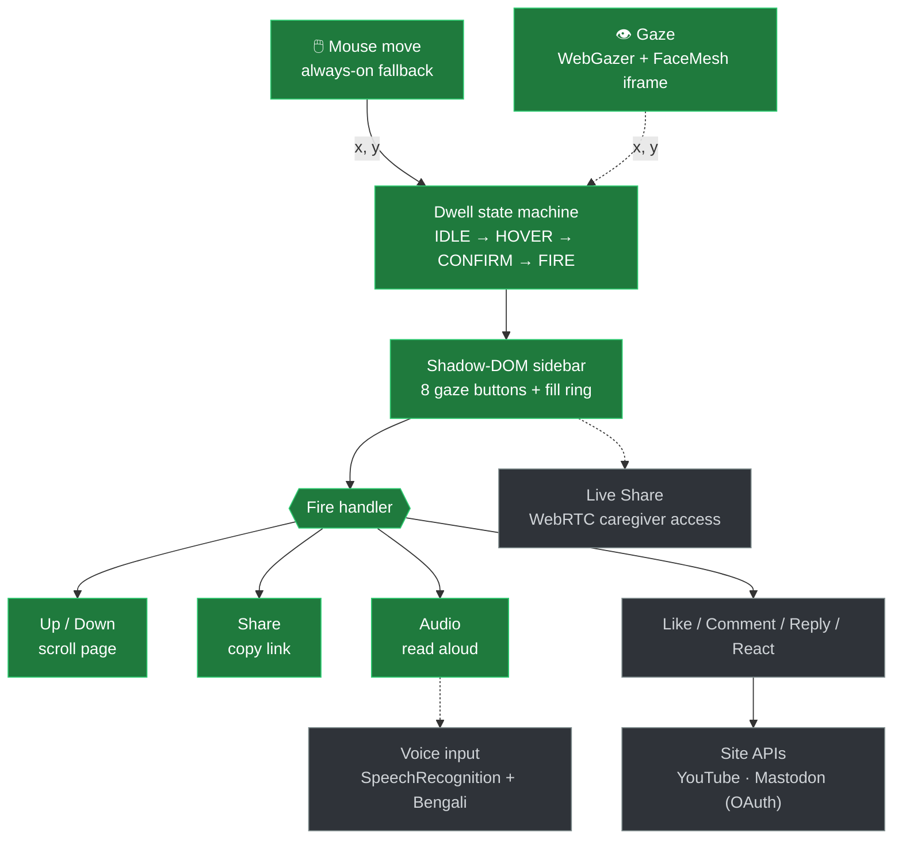

# Project Drishti 2.0

Gaze + Voice browser companion — a hands-free browser extension for motor-impaired
users. See [`Drishti_2.0_Plan.md`](./Drishti_2.0_Plan.md) for the full plan.

Vanilla JS, Manifest V3, no build step. Target sites for the MVP: **YouTube** (Tier 1)
+ **Mastodon** (Tier 2).

## Where the project stands

The diagram below maps the runtime flow and what's built. It's a **living map** —
each build step recolors a node as it lands, so this section grows with the project.

> 🟩 done  ·  🟨 in progress  ·  ⬜ planned



**Working today:** Mouse-driven fallback and gaze-driven control, 720p HD eye-tracking with temporal calibration, magnetic cursor snapping, the 8-button Shadow-DOM sidebar, and the DOM-independent actions (scroll, copy-link, and read-aloud).
**Next:** The voice layer, then the YouTube/Mastodon site APIs.

## Load the extension

The same folder loads unpacked on both browsers — Edge is Chromium-based and runs
the identical Manifest V3 extension. The code uses a normalized API handle
(`browser` on Firefox, `chrome` on Chrome/Edge) so no browser-specific build exists.

**Chrome:**
1. Go to `chrome://extensions`.
2. Turn on **Developer mode** (top-right).
3. Click **Load unpacked** → select this folder (the one containing `manifest.json`).
4. **Drishti 2.0** appears with no errors.

**Edge:**
1. Go to `edge://extensions`.
2. Turn on **Developer mode** (left sidebar).
3. Click **Load unpacked** → select this same folder.
4. **Drishti 2.0** appears with no errors.

> After any code change, click the **reload** ↻ icon on the extension card in
> whichever browser(s) you have it loaded. The content-script console line now
> reports which browser it detected, e.g.
> `[Drishti] content script ready (browser: edge): …`.

## Verify Steps 1 + 2

Load unpacked (above), then open a **normal** web page — e.g. `https://example.com`
or `https://en.wikipedia.org`. Content scripts don't run on `chrome://` pages or the
Chrome Web Store, so don't test there.

**Step 1 — skeleton is alive:**
- On `chrome://extensions`, the **Drishti 2.0** card shows no errors. Click
  **service worker** → its console prints `[Drishti] service worker booted` and
  `[Drishti] service worker installed: install …`.
- On the test page, open DevTools console → you see `[Drishti] content script ready:`
  with a `pong` and a `settings` object (`dwellMs: 750`, `cooldownMs: 400`).

**Step 2 — control surface works (mouse-driven):**
- A dark **sidebar** is pinned to the right edge with 8 buttons top-to-bottom:
  **Up, Like, Comment, Share, Audio, Reply, React, Down**.
- **Hover a button and hold the mouse still** → the button highlights blue and a
  ring fills clockwise over ~750ms.
- When the ring completes it **fires**: the button flashes green, then a ~400ms
  cooldown before it can fire again.
- **Up / Down actually scroll** the page (~80% of a screen). The other six log
  `[Drishti] FIRE '<id>' — action arrives in a later step` in the console — that's
  expected; their real actions come in Steps 4–7.
- Move the mouse off a button before the ring completes → it resets, no fire
  (this is the "Midas touch" guard from §4).

> The mouse is standing in for gaze on purpose. In Step 3, WebGazer feeds the same
> engine screen coordinates and the exact same hover → ring → fire flow runs from
> your eyes — no other change.

## Build order

Progress follows §9 of the plan, one step at a time:

1. ✅ Extension skeleton (MV3, service worker, content script)
2. ✅ Shadow-DOM sidebar + dwell state machine (mouse and gaze driven)
3. ✅ WebGazer integration + calibration (720p HD, temporal sampling, magnetic snapping, zero-eval CSP patch)
4. ✅ DOM-independent actions (scroll, copy-link, read-aloud)
5. ⬜ Audio layer (SpeechSynthesis + SpeechRecognition)
6. ⬜ Tier 1 + Tier 2 APIs (YouTube + Mastodon)
7. ⬜ Site adapters + graceful degradation + earcons + a11y fallback
8. ⬜ Live Share (WebRTC)
9. ⬜ Python helper + first Tier 3 scrape adapter
10. ⬜ Firefox port

## Layout

```
manifest.json                     MV3 manifest
src/background/service-worker.js   message router + settings store
src/content/content.js            page injection + Shadow-DOM host mount
```
