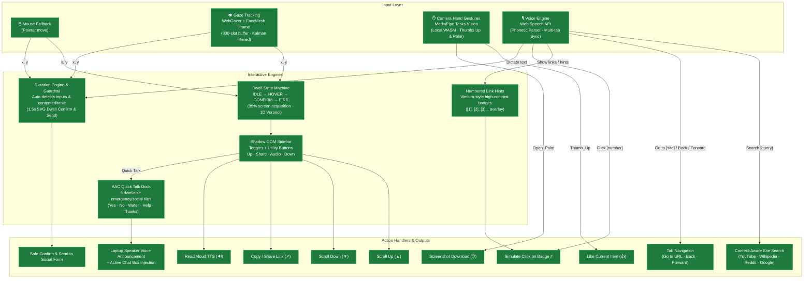

# Project Drishti 2.0

**Gaze + Voice + Gesture Multimodal Browser Companion** — an accessible, hands-free browser extension designed for motor-impaired users (ALS, quadriplegia, cerebral palsy, or temporary motor injury). See [`Drishti_2.0_Plan.md`](./Drishti_2.0_Plan.md) for the original specification.

Vanilla JavaScript, Manifest V3, zero external runtime CDNs, zero build step. Fully self-contained with offline MediaPipe FaceMesh, MediaPipe Tasks Vision models, and browser-native Web Speech APIs.

---

## Architecture & System Flow

The diagram below maps the runtime multimodal flow and currently implemented components:


```mermaid
flowchart TD
    subgraph Inputs ["Input Layer"]
        Mouse["🖱️ Mouse Fallback<br/>(Pointer move)"]
        Gaze["👁️ Gaze Tracking<br/>WebGazer + FaceMesh iframe<br/>(300-slot buffer · Kalman filtered)"]
        Gesture["✋ Camera Hand Gestures<br/>MediaPipe Tasks Vision<br/>(Local WASM · Thumbs Up & Palm)"]
        Voice["🎙️ Voice Engine<br/>Web Speech API<br/>(Phonetic Parser · Multi-tab Sync)"]
    end

    subgraph Interactive ["Interactive Engines"]
        Dwell["Dwell State Machine<br/>IDLE → HOVER → CONFIRM → FIRE<br/>(35% screen acquisition · 1D Voronoi)"]
        Sidebar["Shadow-DOM Sidebar<br/>Toggles + Utility Buttons<br/>Up · Share · Audio · Down"]
        Hints["Numbered Link Hints<br/>Vimium-style high-contrast badges<br/>([1], [2], [3]... overlay)"]
        AAC["AAC Quick Talk Dock<br/>6 dwellable emergency/social tiles<br/>(Yes · No · Water · Help · Thanks)"]
        Dictation["Dictation Engine & Guardrail<br/>Auto-detects inputs & contenteditable<br/>(1.5s SVG Dwell Confirm & Send)"]
    end

    subgraph Actions ["Action Handlers & Outputs"]
        ScrollUp["Scroll Up (▲)"]
        ScrollDown["Scroll Down (▼)"]
        Share["Copy / Share Link (↗)"]
        Read["Read Aloud TTS (🔊)"]
        Like["Like Current Item (👍)"]
        Screenshot["Screenshot Download (✋)"]
        SiteSearch["Context-Aware Site Search<br/>(YouTube · Wikipedia · Reddit · Google)"]
        WebNav["Tab Navigation<br/>(Go to URL · Back · Forward)"]
        ClickHint["Simulate Click on Badge #"]
        SpeakAAC["Laptop Speaker Voice Announcement<br/>+ Active Chat Box Injection"]
        SendPost["Safe Confirm & Send to Social Form"]
    end

    Mouse -->|"x, y"| Dwell
    Gaze -->|"x, y"| Dwell
    Gaze -->|"x, y"| Dictation
    Mouse -->|"x, y"| Dictation
    Gesture -->|"Thumb_Up"| Like
    Gesture -->|"Open_Palm"| Screenshot

    Voice -->|"Search [query]"| SiteSearch
    Voice -->|"Go to [site] / Back / Forward"| WebNav
    Voice -->|"Show links / hints"| Hints
    Voice -->|"Click [number]"| ClickHint
    Voice -->|"Dictate text"| Dictation

    Dwell --> Sidebar
    Sidebar --> ScrollUp
    Sidebar --> ScrollDown
    Sidebar --> Share
    Sidebar --> Read
    Sidebar -->|"Quick Talk"| AAC

    AAC --> SpeakAAC
    Hints --> ClickHint
    Dictation --> SendPost

    classDef done fill:#1f7a3d,stroke:#2ecc71,color:#ffffff;
    class Mouse,Gaze,Gesture,Voice,Dwell,Sidebar,Hints,AAC,Dictation,ScrollUp,ScrollDown,Share,Read,Like,Screenshot,SiteSearch,WebNav,ClickHint,SpeakAAC,SendPost done;
```

---

## Features Implemented

### 1. Multimodal Voice Navigation & Context-Aware Search ([`voice.js`](file:///I:/Drishti%202.0/src/content/voice.js))
- **Hands-Free Navigation:** Speak natural commands such as:
  - *"Go to YouTube"*, *"Open Wikipedia"*, *"Go to Reddit"* (automatically adds TLDs and directs tabs).
  - *"Go back"*, *"Go forward"*, *"Scroll down"*, *"Scroll up"*, *"Scroll to top"*, *"Scroll to bottom"*.
- **Intelligent Context-Aware Site Search:**
  - When browsing sites like YouTube, Wikipedia, Amazon, or Reddit, saying *"Search interstellar"* dynamically queries that specific website's native search bar (e.g. typing directly into `input#search` on YouTube).
  - On general web pages, automatically routes queries to Google Search.
- **Accent & Phonetic Tolerance:**
  - Robust regex pattern matching with phonetic aliasing to reliably recognize speech variations and non-native accents (e.g., handles Edge transcribing *"show links"* as *"show lyncx"*, *"hints"*, *"numbers"*, or spoken digits *"one"* through *"fifty"*).
- **Multi-Tab State Persistence & Silence Auto-Recovery:**
  - Synchronizes user activation state via `chrome.storage.local` across all open tabs.
  - Automatically recovers from routine Chromium speech recognition WebSocket disconnections (`network` error) without turning off the toggle or prompting for permissions.

### 2. Vimium-Style Numbered Link Hints ([`hints.js`](file:///I:/Drishti%202.0/src/content/hints.js))
- **Hands-Free Deep-Page Navigation:**
  - Triggered by saying *"Show links"*, *"Show hints"*, or pressing `Alt + L`.
  - Scans the visible viewport and overlays high-contrast yellow numbered badges (`[1]`, `[2]`, `[3]`, ...) over all visible links, buttons, and form inputs.
- **Direct Speech or Shortcut Selection:**
  - Speak *"Click 4"* or simply *"4"* to simulate an authentic user click and automatically dismiss all active badges.
  - Auto-hides after 12 seconds of inactivity or upon page scroll.

### 3. AAC Quick-Reply Speech Dock ([`aac.js`](file:///I:/Drishti%202.0/src/content/aac.js), [`sidebar.js`](file:///I:/Drishti%202.0/src/content/sidebar.js))
- **Immediate Communication for Non-Verbal Users:**
  - Dwell on the sidebar **`Quick Talk`** tile or press `Alt + A` to toggle an Augmentative and Alternative Communication (AAC) speech drawer.
  - Provides 6 ultra-large, high-contrast dwellable phrase buttons:
    - **`Yes` (✅)**
    - **`No` (❌)**
    - **`Water` (💧)**
    - **`Help!` (🚨)**
    - **`Thanks` (🙏)**
    - **`Back` (↩️)**
- **Dual Output Action:**
  1. Immediately announces the phrase aloud at 100% volume through device speakers using browser-native `SpeechSynthesis`.
  2. Automatically inserts the phrase into any active chat input or message composer (e.g., Discord, WhatsApp Web, Slack, Messenger).

### 4. Social Media Voice Dictation & Gaze Guardrail ([`dictation.js`](file:///I:/Drishti%202.0/src/content/dictation.js))
- **Smart Input Detection:**
  - Automatically binds to focused `input[type="text"]`, `textarea`, or modern `[contenteditable]` rich text editors (Twitter/X, Facebook, YouTube comment threads).
  - Compatible with React and Vue virtual DOMs using prototype value descriptor dispatchers.
- **Accidental Send Prevention (Gaze Guardrail):**
  - Displays a floating docked preview bar showing the transcribed message.
  - Features a **1.5-second SVG Circular Dwell Ring** on `[Confirm & Send]`.
  - Fixating gaze or hovering on the button fills the green dwell progress ring before submitting the form or pressing `Enter`, protecting motor-impaired users from premature accidental sends.

### 5. Streamlined 4-Button Sidebar ([`sidebar.js`](file:///I:/Drishti%202.0/src/content/sidebar.js))
- Isolated in a shadow root on the right viewport edge.
- Header row with independent **Gaze** and **Voice** toggles.
- 4 primary utility targets (~200px tall each, occupying 25% of screen height):
  - **`Up` (▲):** Smooth page scroll up (-80% viewport).
  - **`Share` (↗):** Copies current link to clipboard with native share sheet fallback.
  - **`Audio` (🔊):** DOM-independent text-to-speech read-aloud via Web Speech API. Click again to stop.
  - **`Down` (▼):** Smooth page scroll down (+80% viewport).
- **Wide Fitts' Law Hitboxes:** 35% horizontal screen acquisition zone (`0.65 * innerWidth` to right edge) with zero-gap 1D Voronoi partitioning.

### 6. Camera Hand Gestures ([`frame.js`](file:///I:/Drishti%202.0/src/gaze/frame.js), [`content.js`](file:///I:/Drishti%202.0/src/content/content.js))
- Bundled MediaPipe Tasks Vision `GestureRecognizer` running locally in sandbox iframe:
  - **👍 Thumbs Up (`Thumb_Up`):** Likes the current YouTube video or posts an affirmative toast.
  - **✋ Open Palm (`Open_Palm`):** Captures a high-resolution screenshot via `chrome.tabs.captureVisibleTab` and saves it to the Downloads folder.
  - **Anti-False Trigger:** Enforces wrist elevation threshold ($y \le 0.82$), confidence $\ge 0.50$, and a 2.5-second cooldown.

### 7. Hands-Free 9-Dot Eye Calibration ([`gaze.js`](file:///I:/Drishti%202.0/src/content/gaze.js))
- Sequential 9-point automated eye calibration (~14 seconds total) with 650ms saccadic settle delay per point.
- Gathers 15 samples per dot ($135$ total) into an expanded 300-slot WebGazer regression buffer.
- Hand gestures automatically pause during calibration to reserve 100% processing power for eye tracking.

### 8. Controlled Pointer Dynamics & Anti-Jitter ([`content.js`](file:///I:/Drishti%202.0/src/content/content.js))
- **Slew-Rate Speed Cap ($36\text{px}/\text{frame}$):** Prevents cursor jumping.
- **Fixation Deadband ($<14\text{px}$):** Eliminates micro-tremors during sustained gaze.
- **Progressive Damping:** Fixations ($\alpha = 0.08$), medium shifts ($\alpha = 0.14$), saccades ($\alpha = 0.22$).
- **45% Magnetic Snap:** Anchors the gaze cursor near button centers during dwell.

---

## Keyboard Shortcuts

| Shortcut | Description |
| :--- | :--- |
| `C` | Start / restart hands-free 9-dot eye calibration |
| `Alt + V` | Toggle Voice Engine (speech commands & navigation) |
| `Alt + L` | Toggle Vimium-style Numbered Link Hints overlay |
| `Alt + A` | Toggle AAC Quick Talk Speech Drawer |
| `Alt + D` | Toggle Voice Dictation on currently focused text field |

---

## Load & Test the Extension

Drishti 2.0 runs on Chromium-based browsers: Chrome, Edge, and Brave.

### Installation
1. Open your browser's extensions page:
   - Chrome / Brave: `chrome://extensions` or `brave://extensions`
   - Edge: `edge://extensions`
2. Enable **Developer mode** (top-right or left sidebar).
3. Click **Load unpacked** and select this directory (the root folder containing `manifest.json`).
4. **Project Drishti 2.0** will appear in your extensions list.

### Usage
1. Open any standard website (e.g. [YouTube](https://www.youtube.com), [Wikipedia](https://www.wikipedia.org), or [Reddit](https://www.reddit.com)).
2. **Gaze Control:** Click **"Gaze off"** (or press `C`) to calibrate, then glance at the right 35% of the screen to dwell-activate `Up`, `Share`, `Audio`, or `Down`.
3. **Voice Control:** Click **"Voice off"** (or press `Alt + V`). Speak commands like:
   - *"Show links"* → then *"Click 4"* to follow a link.
   - *"Search astronomy"* → searches inside YouTube or Google.
   - *"Go to Wikipedia"* → opens Wikipedia.
4. **AAC Quick Talk:** Dwell on **"Quick Talk"** (or press `Alt + A`) to open the phrase drawer and dwell on any phrase to speak it aloud.
5. **Hand Gestures:** Give a **Thumbs Up 👍** to like, or show an **Open Palm ✋** to download a screenshot.

---

## Project Structure

```
manifest.json                     MV3 extension manifest & content script permissions
src/
├── background/
│   └── service-worker.js         Message router, storage manager, tab navigation & screenshot capture
├── content/
│   ├── aac.js                    AAC Quick-Reply Speech dock & laptop audio announcements
│   ├── content.js                Content script orchestrator, voice router, pointer dynamics
│   ├── dictation.js              Social voice dictation engine & 1.5s SVG dwell guardrail
│   ├── dwell.js                  Dwell state machine (IDLE → HOVER → CONFIRM → FIRE)
│   ├── gaze.js                   Content-side gaze controller & automated 9-dot calibration UI
│   ├── hints.js                  Vimium-style numbered link hint badges & speech click dispatcher
│   ├── sidebar.js                Shadow-DOM sidebar UI, wide hitboxes, Gaze/Voice toggles
│   └── voice.js                  Web Speech engine, silence auto-recovery, phonetic command parser
├── gaze/
│   ├── frame.html                Full-viewport sandbox overlay for WebGazer + Tasks Vision
│   └── frame.js                  WASM model execution, camera feed capture, gesture detection
└── vendor/
    ├── mediapipe/
    │   ├── face_mesh/            Bundled FaceMesh solution assets & WASM
    │   └── gesture_recognizer/   Bundled MediaPipe Tasks Vision bundle, WASM & .task model
    └── webgazer.js               Bundled WebGazer library (patched with 300-slot data window)
```

---

## License

GPLv3 / LGPLv3 (aligned with WebGazer.js and MediaPipe open-source licenses).
